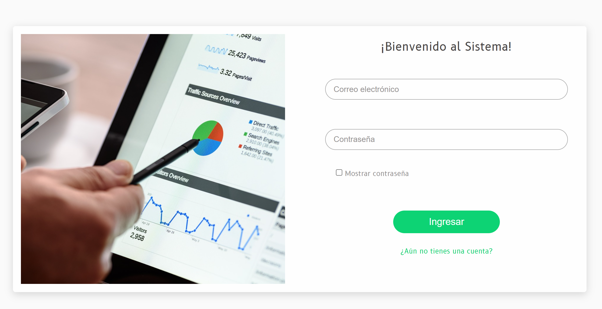
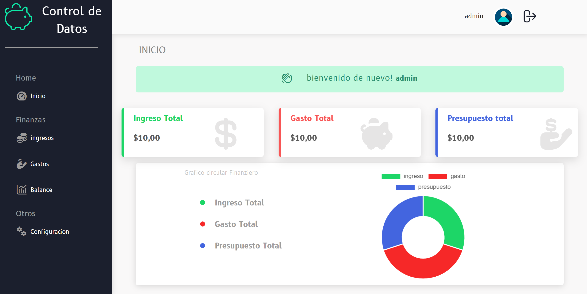

# Sistema-Gestion-de-Finanza-Personal

Este es un sistema de Gestion de gastos e Ingresos para cualquier persona

## Objetivos

- llevar tus finanzas controladamente ✅
- evaluar tus ingresos como egresos 📊
- poner una meta de presupuesto 📑
- hacer que tus finanzas esten a tu control 📗

## modo de uso del software
✅clone el repositorio
✅instale la base de Datos descarguela de la carpeta database(db_finanzas.sql)
✅cambie las credenciales de el root y el password segun su servidor local en la carpeta de Modelo en el archivo de conexion.php
✅Luego ejecute para su funcionamiento
## Lenguajes Usados💻
# Javascript(para el Front End)
    javascript se uso para la forma dinamica en el front end
# Php (para el Backend)
    php se uso para el manejo en servidor como el registro y inicio de session
# html y css para la apariencia
    html y css para la apariencia del estilizado y estructura
# Mysql(para la base de Datos)
    Mysql para la estructura de la base de datos
## Resumen:
    en este proyecto usamos dos lenguajes de programacion manejamos en el cliente y servidor(front end y el back end) usamos una estructura de base de datos tomando el proceso desde su planeacion hasta el desarrollo cabe recalcar que se puede subir a un servidor en la nube.
## License

[MIT](https://choosealicense.com/licenses/mit/)

## Screenshots

